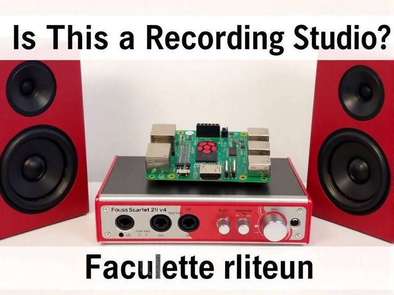

# TKonan
Off to an awesome start!

Wow, no hints about formatting when editing this README.md file. I'm sure I've seen formatting. Perhaps I need to make a README.html.

But no! GitHub doesn't allow any HTML readme, it seems. The way is **md** - markdown, and there's a whole syntax for it described at [GitHub Writing and Formatting](https://docs.github.com/en/get-started/writing-on-github/getting-started-with-writing-and-formatting-on-github/basic-writing-and-formatting-syntax).

Here's a basic HTML structure template within this MD:

```
<!DOCTYPE html>
<html>

<head>
<title>Semantic HTML5 - It Has Meaning!</title>
<meta charset='utf-8'>

<style>
</style>

</head>


<body>

<script>
</script>

</body>

</html>
```

## An image would be nice..


No way of centring it though :neutral_face:.

Here's a thought... or rather, here's a regurgitation of a thought by Stable Diffusion:



It's supposed to be a bit different. Well... this is the prompt I gave it:

A Raspberry Pi 5 in its official red and white case is sitting on top of a Focusrite Scarlett 2i2 v4 USB Audio interface, on a white background. There are only these 2 things in the image other than banner titles at the top and bottom.

A banner title above says 'Is This a Recording Studio?', and a banner title at the bottom says 'Do they go together?'.

Negative: Messiness, untidiness, additional items, technical inaccuracy, bare PCB
